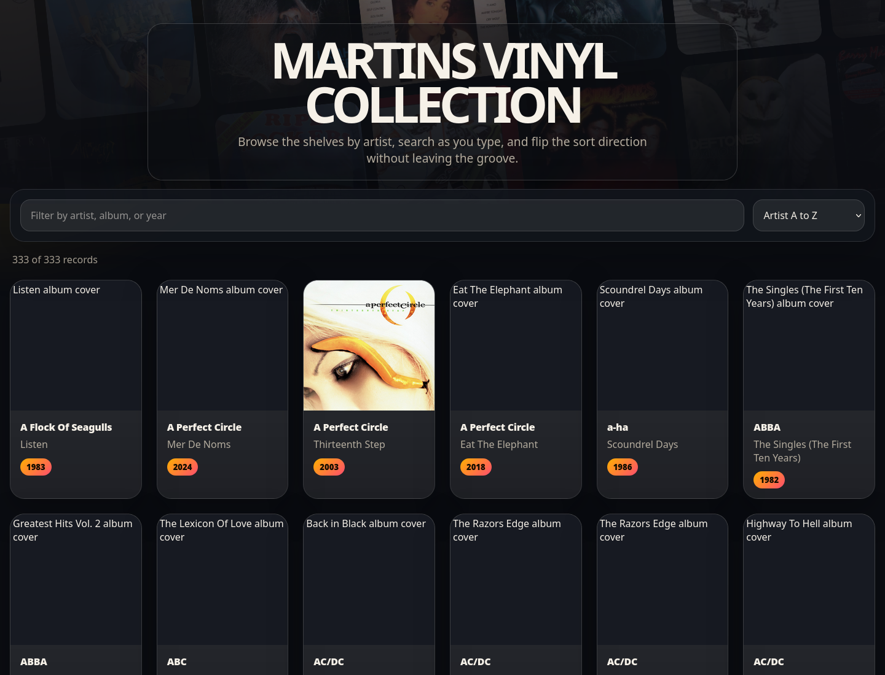

# Discogsy

Discogsy is a small self-hosted Go web app for browsing a Discogs vinyl collection. It syncs records from the Discogs API, stores a local JSON copy of the collection, downloads release artwork, and serves a responsive searchable gallery.



## Features

- Syncs the authenticated user's Discogs collection through the Discogs API.
- Stores collection metadata locally as JSON for fast startup and offline browsing.
- Downloads album artwork into a local poster directory.
- Serves a single-page vinyl collection browser with search and sorting controls.
- Refreshes the browser data periodically without a full page reload.
- Runs as a minimal Docker image with persistent Docker volume storage.

## Requirements

- Docker and Docker Compose for the recommended runtime.
- A Discogs account username.
- A Discogs personal access token.
- Go 1.26.3 or newer for local development without Docker.

## Quick Start With Docker Compose

1. Copy the sample environment file:

   ```sh
   cp .env.example .env
   ```

2. Edit `.env` and provide your Discogs values:

   ```sh
   DISCOGS_USERNAME=your-discogs-username
   DISCOGS_TOKEN=your-discogs-personal-access-token
   VINYL_COLLECTION_NAME=My Vinyl Collection
   PORT=8082
   COLLECTION_PATH=/data/discogs_collection.json
   POSTER_DIR=/data/posters
   ```

3. Build and start the app:

   ```sh
   docker compose up -d --build
   ```

4. Open the site:

   ```text
   http://localhost:8082
   ```

5. View logs if you need to check sync progress:

   ```sh
   docker compose logs -f discogsy
   ```

6. Stop the app when finished:

   ```sh
   docker compose down
   ```

## Configuration

Discogsy reads configuration from environment variables. Docker Compose loads these from `.env`.

| Variable                | Required | Default                   | Description                                                                                            |
| ----------------------- | -------- | ------------------------- | ------------------------------------------------------------------------------------------------------ |
| `DISCOGS_USERNAME`      | Yes      | None                      | Discogs username whose collection should be synced.                                                    |
| `DISCOGS_TOKEN`         | Yes      | None                      | Discogs personal access token used for API and image requests.                                         |
| `VINYL_COLLECTION_NAME` | Yes      | None                      | Display name used in the page hero heading.                                                            |
| `PORT`                  | No       | `8082`                    | HTTP port used by the server and exposed by Docker Compose.                                            |
| `COLLECTION_PATH`       | No       | `discogs_collection.json` | Path to the local JSON collection cache. The Docker image defaults to `/data/discogs_collection.json`. |
| `POSTER_DIR`            | No       | `posters`                 | Directory where downloaded release artwork is stored. The Docker image defaults to `/data/posters`.    |

The app also accepts the legacy variable names `USERNAME` and `TOKEN` as fallbacks for `DISCOGS_USERNAME` and `DISCOGS_TOKEN`.

## Data Storage

When run with Docker Compose, collection data is stored in the named volume `discogsy-data`:

- `/data/discogs_collection.json` contains the synced collection metadata.
- `/data/posters` contains downloaded cover artwork.

The `.gitignore` excludes `.env`, the local JSON collection file, and poster directories so personal data and credentials are not committed.

## Local Development

Run the app directly with Go after creating `.env` or exporting the same variables in your shell:

```sh
go run .
```

The default local data paths are relative to the repository root:

- `discogs_collection.json`
- `posters/`

Run tests with:

```sh
go test ./...
```

Build a local binary with:

```sh
go build -o discogsy .
```

## HTTP Endpoints

| Endpoint              | Description                                     |
| --------------------- | ----------------------------------------------- |
| `/`                   | Renders the collection browser.                 |
| `/api/records`        | Returns the current collection records as JSON. |
| `/posters/{filename}` | Serves downloaded release artwork.              |

## How Sync Works

On startup, Discogsy loads the local collection cache and serves it immediately. A background sync then runs every 1 hour. During sync, the app fetches all releases from the Discogs collection folder `0`, adds or updates local records, downloads missing artwork, saves the sorted JSON cache, and updates the in-memory web store.

## Troubleshooting

- `missing required environment variable`: confirm `.env` exists and contains `DISCOGS_USERNAME`, `DISCOGS_TOKEN`, and `VINYL_COLLECTION_NAME`.
- Empty collection page: check `docker compose logs -f discogsy` for Discogs API errors or token issues.
- Port already in use: change `PORT` in `.env`, then restart with `docker compose up -d --build`.
- Artwork not appearing: confirm the app can write to `POSTER_DIR` and that Discogs image requests are succeeding.

## Project Structure

```text
.
├── Dockerfile
├── docker-compose.yml
├── go.mod
├── main.go
├── internal
│   ├── collection
│   │   └── collection.go
│   ├── discogs
│   │   └── sync.go
│   └── web
│       ├── index.html
│       └── server.go
└── docs
    └── assets
        └── discogsy-home.png
```
